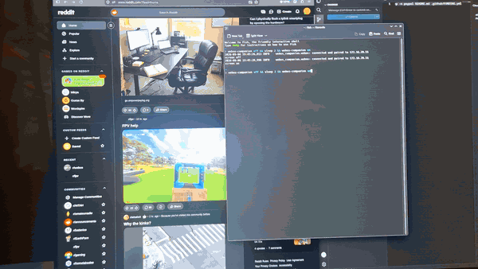

# webOS Companion

Make an LG WebOS TV behave like a normal PC monitor on Linux: follow the display
power state, so the panel goes off when the desktop blanks the screen and the TV
powers down when the machine suspends or shuts down — for OLED burn-in
protection and a bit of power saving.

A Linux port of [**LGTV Companion**](https://github.com/JPersson77/LGTVCompanion)
(Windows) — see [Credits](#credits).

<!-- DEMO GIF — replace this comment with:
     
     A ~10s clip: desktop goes idle -> TV panel clicks off -> wake -> it's back.
     Record with a phone (TV + monitor in frame) or asciinema for the journal side.
     Put the file at docs/demo.gif and commit it. -->


> **Status: early (0.1).** Verified end-to-end on one setup (KDE Plasma 6 /
> Wayland, one LG C2). Lots of common configurations are untested, and there are
> real limitations — see [Project status](#project-status) below. **Feedback is
> very welcome and genuinely useful**, including "it just works on X".

| When your desktop… | …the TV does |
| --- | --- |
| turns the screen off to save power (idle blank) | `turnOffScreen` — panel black, TV stays powered and on the network; wake is instant |
| turns the screen back on | `turnOnScreen` (reconnect + Wake-on-LAN first if the TV dropped off) |
| **suspends / sleeps** | `system/turnOff` — real power-down |
| **resumes** | Wake-on-LAN, reconnect, restore the screen state |
| **shuts down / reboots** | `system/turnOff` |

User-idle handling is left to the desktop. A bare session lock is deliberately
*not* a trigger (the screen-blank that usually follows one is).

## Project status

This is a one-person 0.1 built and run against a single real setup. It was
**"vibe coded" with [Claude Code](https://claude.com/claude-code)** — the design
decisions and real-hardware testing are mine, but the bulk of the implementation
was written by an LLM. Read the code before trusting it on an expensive panel.
The daemon logic is well covered by tests, but "does it behave on *your* TV /
desktop / GPU" is largely unverified. Here's the honest state:

**Verified end-to-end on real hardware:**

- CachyOS (Arch), **KDE Plasma 6 / Wayland**, **NVIDIA RTX 3080 Ti** (proprietary
  `nvidia` driver), one **LG C2** (OLED42C2PUA, webOS 22), TV on the same subnet
  as the PC.
- Idle screen-blank → panel off → wake; **suspend** → TV powers off; **resume**
  → Wake-on-LAN brings it back; **shutdown** → TV powers off.
- Network discovery, pairing, and the primary DRM `dpms` trigger.

**Tested, but not against a real TV:**

- Full unit suite (83 tests) on **Python 3.11–3.14**, on Arch, Debian 12,
  Ubuntu 24.04, Fedora 41, openSUSE Tumbleweed (D-Bus mocked, fake TV server).
- The documented `pipx install git+URL` path + CLI entry point, on those same
  five distros, from the published repo (`test-install.sh`).
- Real host D-Bus / DRM paths and live TV *discovery* from Debian / Ubuntu /
  Fedora / openSUSE userspace (tier 2 in [TESTING.md](TESTING.md)).
- A non-KWin compositor (**weston**, in a VM) flips `/sys/class/drm/*/dpms` on
  idle exactly as KWin does — so the DRM trigger isn't KDE-specific.

**Not yet tested — reports especially wanted:**

| Area | Notes |
| --- | --- |
| **GNOME / Mutter**, **Sway / wlroots** on real hardware | Expected to work. Sway has no `org.freedesktop.ScreenSaver`, so it relies solely on the DRM trigger. |
| **AMD / Intel GPUs**, **nouveau** | Verified on the NVIDIA proprietary driver. The trigger reads a kernel sysfs `dpms` node that the in-tree atomic drivers maintain too, so it *should* be driver-agnostic. |
| **Other webOS versions / models** | Only the C2 (webOS 22). Older (webOS 3–6) and newer (C3/C4/G-series) unverified. |
| **Other distros / non-systemd init** | systemd `--user` is required; nothing else is supported. |

### Limitations — by design

- **User-idle and the lock screen are out of scope** — deciding *when* to blank
  is the desktop's job; this reacts only to the blank itself, not to idle timers
  or a bare session lock.
- **X11 sessions are not supported** — the screen-off trigger reads Wayland/KMS
  state. Wayland + systemd only; no support for other init systems.
- **One layer-2 segment** — Wake-on-LAN is a broadcast frame, so the PC and TV
  must share a subnet. It can't cross a router or VLAN.
- **TLS to the TV is not verified** (`CERT_NONE`) — webOS TVs serve self-signed
  certs; every webOS client does this. The pairing key is stored in plain text
  at `~/.local/state/webos-companion/client-key` (mode `0600`).

### Limitations — not built yet / rough edges

- **One TV, one display connector.** The config holds a single TV, and the DRM
  watcher follows a single connector. No multi-TV support and no
  monitor-topology awareness — in a multi-monitor setup it reacts only to the
  connector it's watching, regardless of the others.
- **Two LG panels confuse auto-detect.** The LG panel is found by EDID vendor
  ID; with more than one, it logs a warning and guesses. Set `connector` in
  `config.yaml` to be explicit.
- **The screen-off trigger is a ~2 s poll**, not an event — so there's up to
  ~2 s of latency, and an off→on flip inside one interval is missed.
- **No HDMI input switching.** After a Wake-on-LAN wake the TV may come back on
  a different input; it's not switched back.
- **Post-resume recovery gives up after 5 minutes.** If the network or TV takes
  longer than that to come back, the TV is left as-is until the next event.
- **Barely any model-specific handling.** Tested only on a C2 (webOS 22); the
  set of "panel is awake" power states is a guess for other firmware. If the TV
  un-pairs this PC, re-pair with `webos-companion pair`.

## Roadmap

Rough priority order. Issues and PRs welcome on any of these.

| Planned | Status |
| --- | --- |
| Real GNOME/Mutter + Sway/wlroots verification on hardware | needs testers |
| Wider webOS version / model coverage | needs "works on X" reports |
| HDMI input restore after a Wake-on-LAN wake | not started |
| AUR package | `packaging/PKGBUILD` ready — needs the `v0.1.0` tag pushed |
| PyPI release | not started |
| Event-driven (udev) DRM watch instead of the 2 s poll | idea |
| Multi-TV / per-connector configuration | idea — depends on demand |

Not planned: user-idle handling, X11, cross-subnet Wake-on-LAN (see the
by-design limitations above).

## Feedback

Please open an issue — the [bug report template](.github/ISSUE_TEMPLATE/bug_report.md)
asks for distro, desktop, GPU, webOS version, and a journal snippet. **"Works on
my setup" reports are just as valuable as bug reports** — they're how the tested
list above grows. The goal is for this to be as useful as possible to as many
setups as possible, and that only happens with reports from setups I can't test
myself.

## Requirements

- Linux with **systemd** and a **Wayland** session (tested on KDE Plasma 6)
- **Python ≥ 3.11**
- **pipx** (to install it cleanly in its own venv)
- An LG **webOS** TV on the same subnet, with *"Turn on via Wi-Fi"* and
  *"Quick Start+" / "Always Ready"* enabled in its settings

Runtime Python deps (`websockets`, `dbus-fast`, `pyyaml`) are pulled in
automatically by the install.

## Install

Full walkthrough, no prior Linux-packaging knowledge assumed:
**[INSTALL.md](INSTALL.md)**. The short version:

```sh
pipx install git+https://github.com/jayge91/webos-companion
webos-companion setup
```

`setup` scans the network, lists the TVs it finds (IP / MAC / name / model),
writes `~/.config/webos-companion/config.yaml`, pairs, and installs a
`systemctl --user` service. Then:

```sh
systemctl --user status webos-companion
journalctl --user -u webos-companion -f
```

Update: `pipx upgrade webos-companion && systemctl --user restart webos-companion`.
Uninstall: `webos-companion service remove && pipx uninstall webos-companion`.

## How it works

Three trigger sources feed a 3-state machine (`ON` / `SCREEN_OFF` /
`POWERED_OFF`) driving one persistent WebOS websocket client:

- **`triggers/drm.py`** — polls `/sys/class/drm/<connector>/dpms` (world-readable)
  every 2 s. The LG panel is auto-detected by EDID vendor id; override with
  `connector` in the config.
- **`triggers/logind.py`** — `org.freedesktop.login1` `PrepareForSleep` /
  `PrepareForShutdown` on the system bus, plus a **delay inhibitor** so the TV is
  off before the machine actually sleeps.
- **`triggers/screensaver.py`** — `org.freedesktop.ScreenSaver` `ActiveChanged`
  on the session bus. **Off by default** (`screensaver_dbus`) — it also fires on
  a bare lock. Turn it on where the sysfs `dpms` node doesn't move (some
  compositors). Not provided by Sway.

After a resume, a background recoverer waits for the network, then keeps trying
Wake-on-LAN + reconnect (with backoff, up to 5 min) until the TV answers.

Everything runs unprivileged.

## Development / testing

```sh
docker compose run --rm test      # 83 unit tests, ~6s (D-Bus mocked, fake TV server)
```

The documented `pipx install` path is checked on Arch / Debian 12 / Ubuntu 24.04
/ Fedora 41 / openSUSE Tumbleweed by `./test-install.sh` (against the published
repo). Multi-distro build/integration and the compositor / VM checks are in
**[TESTING.md](TESTING.md)** (`test-distros.sh`, `test-integration.sh`,
`test-vm.sh` — all containerised, nothing installed on the host).

## Credits

This is a Linux port of **[LGTV Companion](https://github.com/JPersson77/LGTVCompanion)**
by **Jörgen Persson** (MIT). The daemon is a fresh Python implementation, but it
is a derivative work:

- `webos_companion/lg_api.py` — the WebOS pairing manifest and the SSAP command
  URIs are copied from that project's `Common/lg_api.h`.
- The event → TV-command design, the Wake-on-LAN magic-packet format, and the
  "blank screen vs. power off" distinction come from studying its
  `web_os_client.cpp`.

The original is a full-featured Windows application (service + tray UI + CLI +
API) with years of model-specific handling. If you're on Windows, use that.

This project was **"vibe coded" with [Claude Code](https://claude.com/claude-code)**:
the architecture choices, the scope, and all real-hardware testing are mine, but
most of the code was LLM-written. Bug reports and code review from humans are
especially welcome — see [Feedback](#feedback).

## Support

If this saved your panel, you can [buy me a coffee](https://paypal.me/JonathonMcGee495).
It goes toward the hardware this is tested on and time spent on issues and
compatibility reports — no pressure, the software is free either way.

Please also consider supporting **[Jörgen Persson](https://www.paypal.me/jpersson77)**,
who wrote the original LGTV Companion this is a port of.

## License

MIT — see [LICENSE](LICENSE). Carries Jörgen Persson's copyright for the
portions taken from the upstream project, per its MIT terms.
